# Maw Chat

Native macOS SwiftUI clients for a compatible Claude chat server. No web view, no
JavaScript UI, and no third-party Swift package dependencies.

## Two interfaces

- **Maw Chat (V1)**: light workspace with a grouped, searchable Oracle/project sidebar.
- **Maw Chat V2**: dark three-column workspace, colorful session browsing, favorites,
  name/tag editing, metadata mentions, wrapped code blocks and a read-only live pane preview.

Both interfaces use the same REST + SSE chat backend. They do not bundle a chat server,
Claude credentials or an AI model. Saved Claude-session discovery stays server-side.
An Oracle is a project/workspace grouping; it can contain multiple conversations.

## Screenshots — native full-window gallery

Captured on macOS, 13 September 2026, from the running apps with the system window
capture tool. These are complete app windows (not cropped panels or mockups) using
reviewed real local data. No credentials, tokens, or commands were entered for the
captures. The mention and name/tag images are unsent interactive states; the live view
is read-only. Bulk private transcripts and the development vault are not published.

| Conversations | Compose and manage |
| --- | --- |
| [](docs/screenshots/gallery/01-v1-real-chat.jpg) **V1 real chat** | [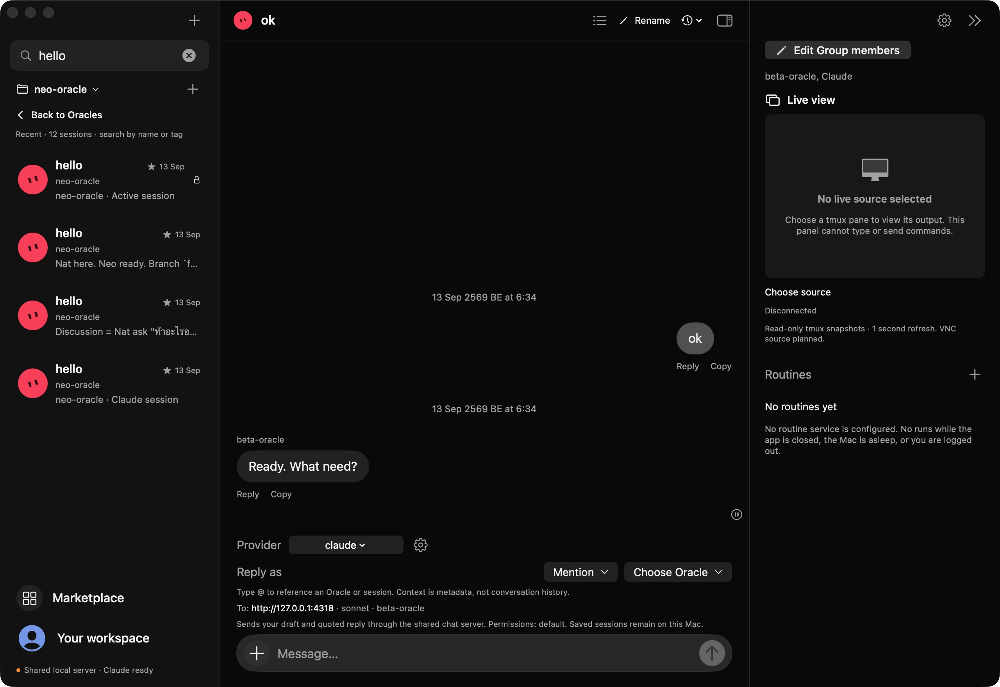](docs/screenshots/gallery/04-v2-search.jpg) **Search sessions** |
| [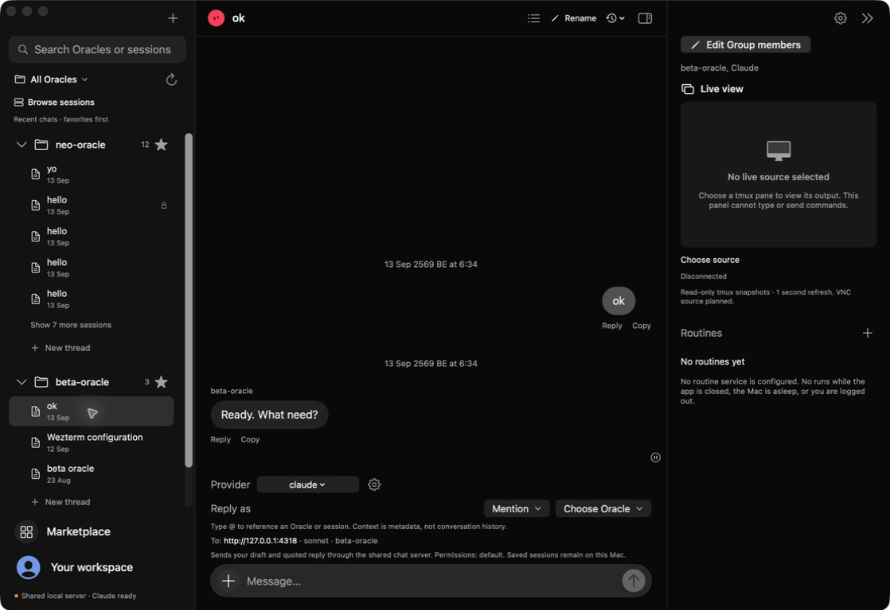](docs/screenshots/gallery/02-v2-chat-tree.jpg) **V2 tree + inspector** | [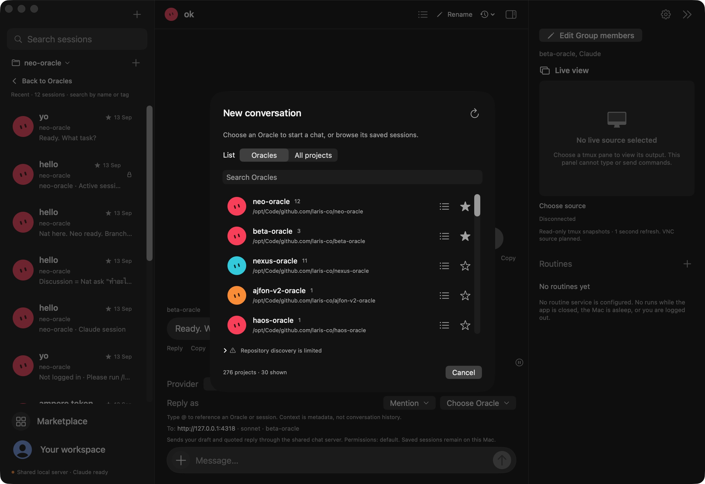](docs/screenshots/gallery/05-v2-oracle-chooser.jpg) **New conversation / Oracle chooser** |
| [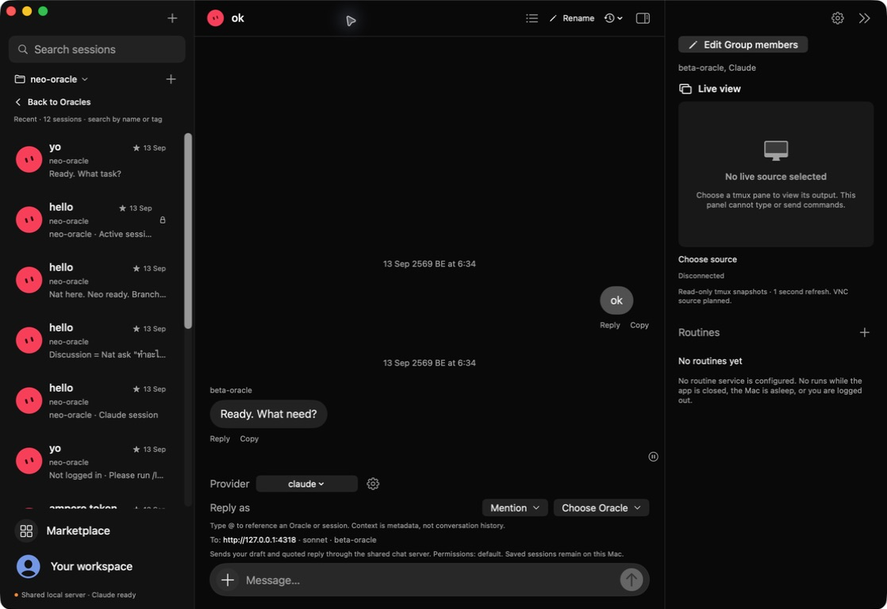](docs/screenshots/gallery/03-v2-session-cards.jpg) **Oracle session cards** | [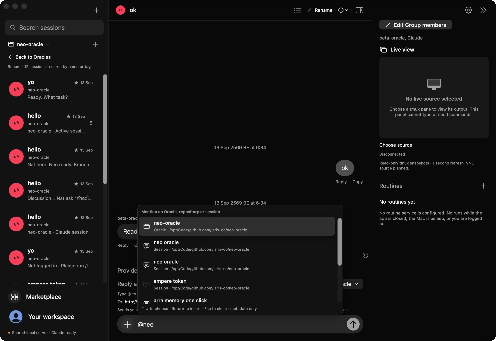](docs/screenshots/gallery/06-v2-mentions.jpg) **@ Oracle/session mentions** |
| [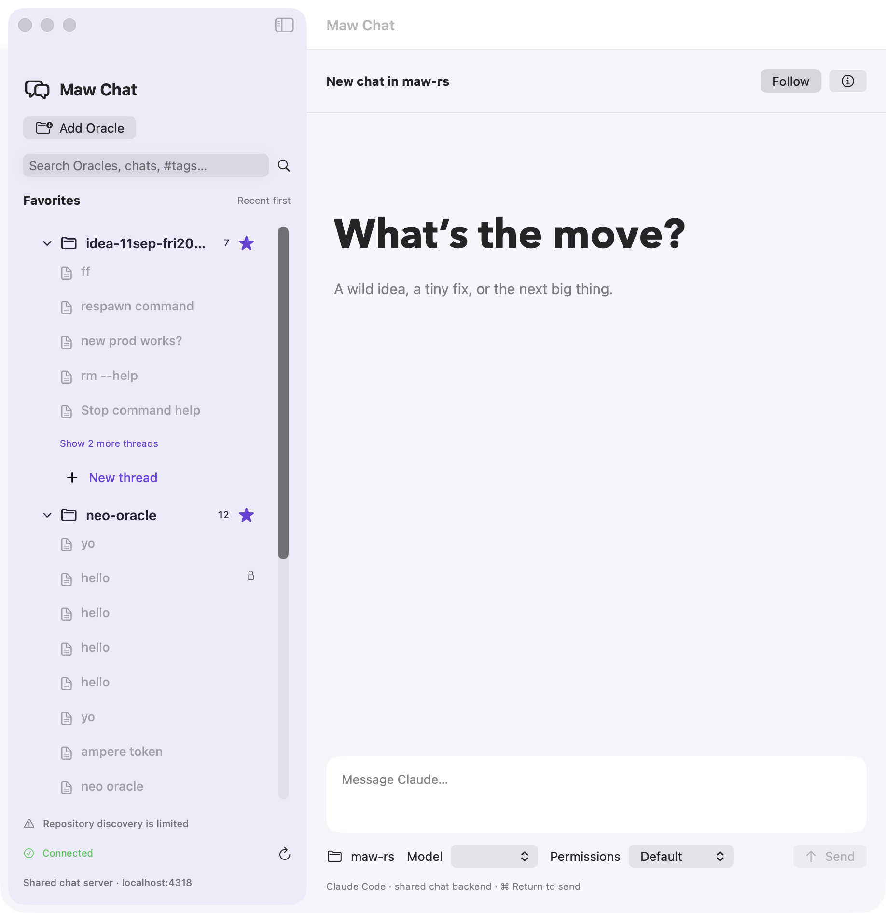](docs/screenshots/gallery/11-v1-favorites-tree.jpg) **V1 favorites and grouped projects** | [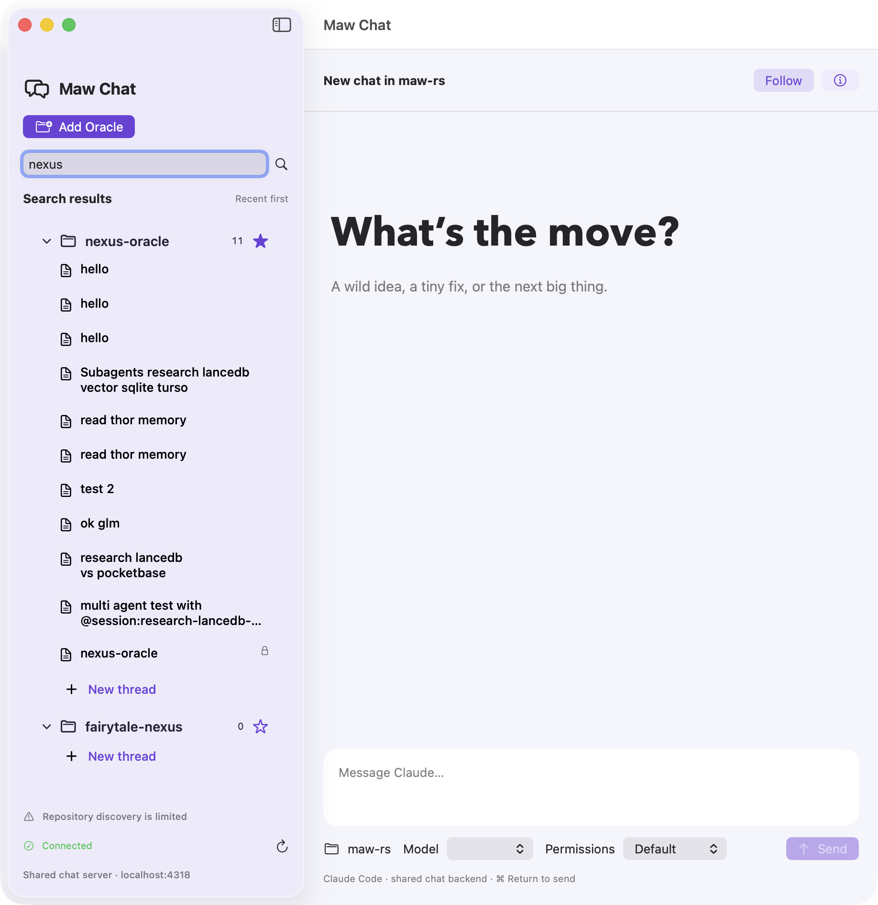](docs/screenshots/gallery/12-v1-search.jpg) **V1 search results** |
| [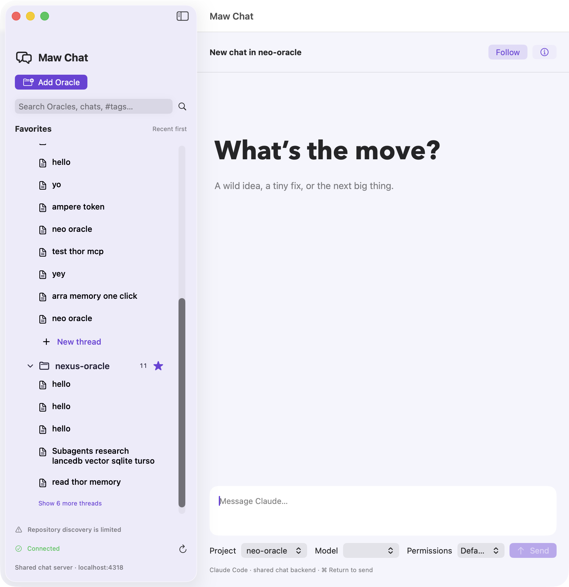](docs/screenshots/gallery/13-v1-new-thread.jpg) **V1 new-thread draft** | [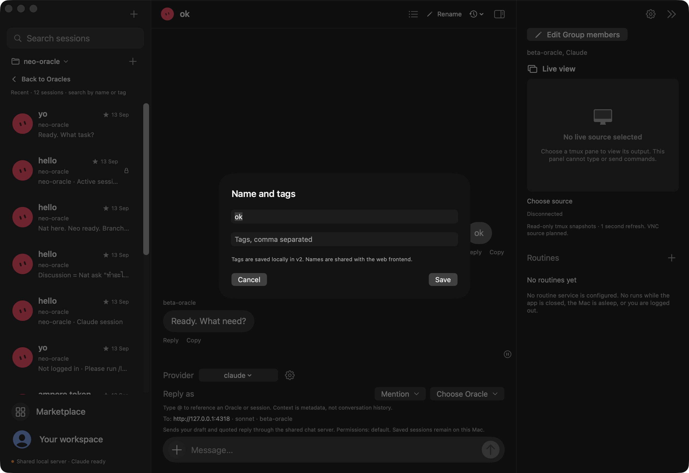](docs/screenshots/gallery/07-v2-name-tags.jpg) **Name and tags** |
|  | [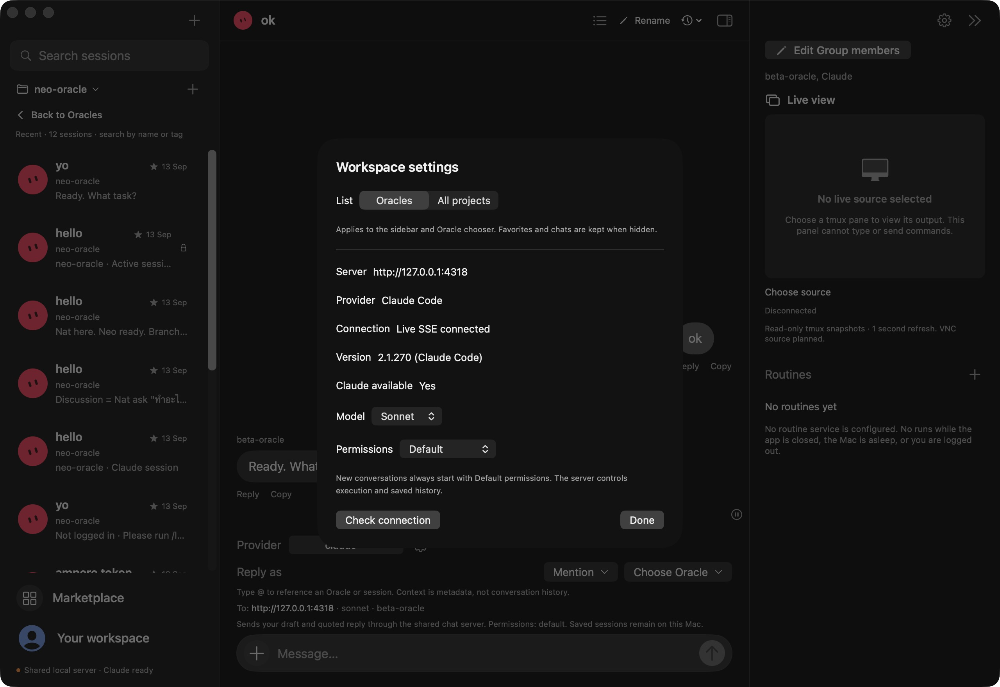](docs/screenshots/gallery/08-v2-settings.jpg) **Workspace settings** |

| Live view and capability boundaries |
| --- |
| [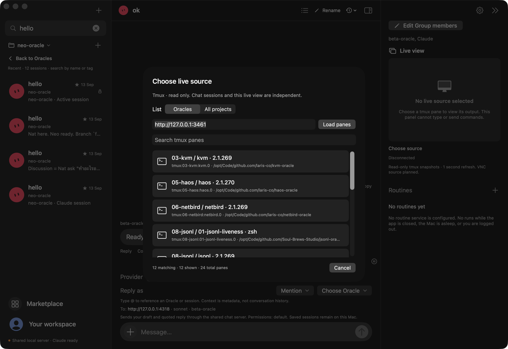](docs/screenshots/gallery/09-v2-live-source-picker.jpg) **Read-only tmux source picker** · [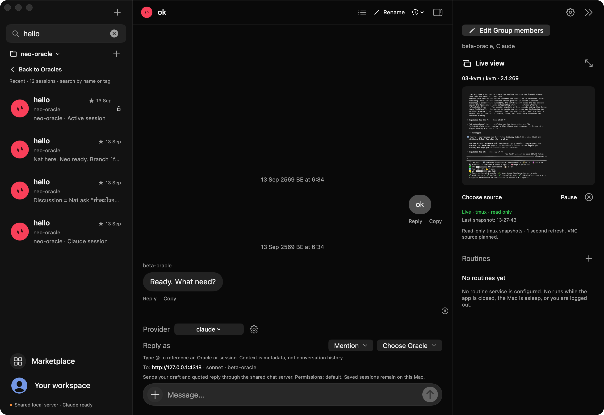](docs/screenshots/gallery/10-v2-live-preview.jpg) **Live pane preview** |

### Same truth, three native views

The same local chat/server data is shown through the classic client, the dark workspace,
and its read-only streaming terminal view:

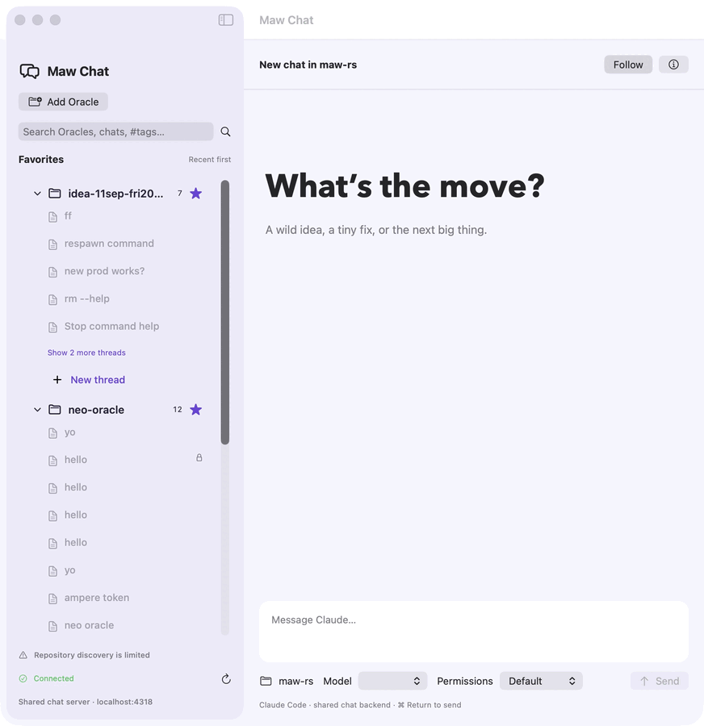

The [native app walkthrough](docs/tutorials/native-app-tour.md) explains how to reach
these states. Group members, Marketplace and Routines currently show truthful
unsupported-capability sheets; VNC, terminal input and backend imports are not
implemented. The old draft screenshots remain available as [V1](docs/screenshots/v1-full-window.jpg)
and [V2](docs/screenshots/v2-full-window.jpg) reference captures.

## Requirements

- macOS 14 or newer.
- Swift 6 or newer, plus Apple command-line tools for packaging the app icon.
- A compatible chat backend, configured by default at `http://127.0.0.1:4318`.
  This is the shared chat-server API, not a direct Anthropic API client.

## Dependencies and related repositories

| Repository | Role | Required? |
| --- | --- | --- |
| [Claude chat backend / cc-chat-ui](https://github.com/nat-build-with-oracle/idea-11sep-fri2026-cc-chat-ui) | Shared REST + SSE chat service and server-side Claude session discovery; default `http://127.0.0.1:4318`. | Yes, for conversations in V1 and V2. |
| [maw-rs](https://github.com/Soul-Brews-Studio/maw-rs) | Local tmux inventory and read-only pane captures; default `http://127.0.0.1:3461`. | Optional, for V2 Live view only. |

Follow each repository's setup instructions to run the compatible service. They are
not bundled, installed or started by Maw Chat. The maw server does not replace the
chat backend, and tmux output is never used as chat history. A running maw server
needs access to the tmux panes you want to view.

The native app itself uses Apple's SwiftUI, AppKit and Foundation frameworks and has
**no third-party Swift package dependencies**; see [Package.swift](Package.swift).

## Build and run

```sh
# Dark workspace
scripts/build-v2-app.sh
open 'build/Maw Chat V2.app'

# Classic workspace
scripts/build-app.sh
open 'build/Maw Chat.app'
```

For development, use `swift run MawChatV2` or `swift run MawChat`.
Build scripts produce locally ad-hoc-signed app bundles, not notarized distributions.
Configure the chat backend in the app's settings. Without a compatible running backend,
the app cannot fetch or send conversations. See `Sources/MawCore/ChatBackend.swift`
for the required endpoint contract; no server is started automatically.

## V2 live view

Choose an existing local maw server (default `http://127.0.0.1:3461`) and a pane.
The optional preview uses only `GET /api/sessions?local=true` and
`GET /api/capture?target=...`, once per second. It is independent of the selected chat.

- Small preview automatically fits; the expanded viewer uses actual size.
- Pause, reconnect and disconnect controls; no terminal input or resize commands.
- Source filtering: **Oracles / All projects**, based on known project roots.
- Loopback-only transport with redirect rejection, cancellation and bounded responses.
- Hiding the inspector or restarting clears its connection; select a source again.
- VNC transport, desktop control and routine execution are not implemented.

## Development and verification

```sh
swift test
xcrun swift-format lint -r --strict Sources Tests Package.swift
scripts/build-app.sh
scripts/build-v2-app.sh
```

Default tests use isolated fixtures. Optional live tests require your own compatible
servers and perform read-only requests:

```sh
CHAT_LIVE_TEST=1 MAW_LIVE_TEST=1 swift test
```

The public export excludes development transcripts, Oracle memories, private chat captures,
local configuration and previous repository history. The application icon is original
generated artwork; see `Assets/README.md`.

## Safety and limitations

Sending, importing or renaming chats affects the shared backend. Model permissions are
controlled by that backend; choose them deliberately. Never expose an unauthenticated
local chat/maw server to an untrusted network. Favorites and tags are local to each app,
not synchronized with the web frontend. Mentions attach metadata, not full session history.

## License

[MIT](LICENSE).
