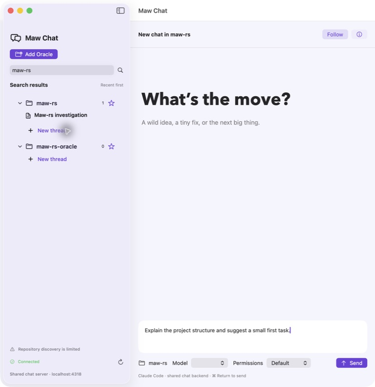
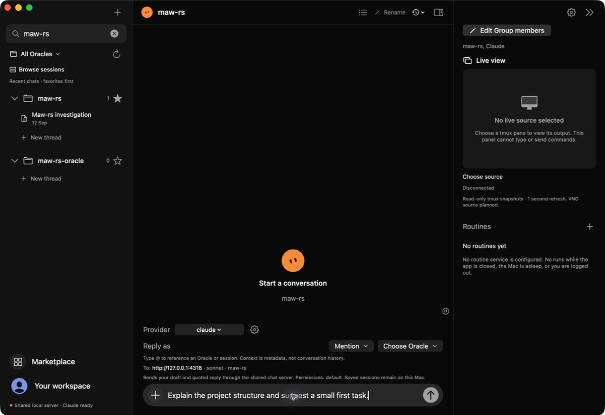

# Maw Chat

Native macOS SwiftUI clients for a compatible Claude chat server. No web view, no
JavaScript UI, and no third-party Swift package dependencies.

## Two interfaces

- **Maw Chat (V1)**: light workspace with a grouped, searchable Oracle/project sidebar.
- **Maw Chat V2**: dark three-column workspace, colorful session browsing, favorites,
  name/tag editing, metadata mentions, wrapped code blocks and a read-only live pane preview.

Both interfaces use the same REST + SSE chat backend. They do not bundle a chat server,
Claude credentials or an AI model. Saved Claude-session discovery stays server-side.
An Oracle is a project/workspace grouping; it can contain multiple conversations.

## Screenshots — full native windows

Captured on macOS, 13 September 2026. Both show a real, **unsent example draft**;
no messages were submitted for these captures. Private conversation history and terminal
output are not shown. These are full app-window captures, not cropped panels or mockups.

### V1 — classic light workspace



### V2 — dark three-column workspace



Follow the [native app walkthrough](docs/tutorials/native-app-tour.md) to reach these
screens. The screenshots retain each app's own window size; the surrounding desktop
and other applications are not included.

## Requirements

- macOS 14 or newer.
- Swift 6 or newer, plus Apple command-line tools for packaging the app icon.
- A compatible chat backend, configured by default at `http://127.0.0.1:4318`.
  This is the shared chat-server API, not a direct Anthropic API client.

## Dependencies and related repositories

| Repository | Role | Required? |
| --- | --- | --- |
| [Claude chat backend / cc-chat-ui](https://github.com/nat-build-with-oracle/idea-11sep-fri2026-cc-chat-ui) | Shared REST + SSE chat service and server-side Claude session discovery; default `http://127.0.0.1:4318`. | Yes, for conversations in V1 and V2. |
| [maw-rs](https://github.com/Soul-Brews-Studio/maw-rs) | Local tmux inventory and read-only pane captures; default `http://127.0.0.1:3461`. | Optional, for V2 Live view only. |

Follow each repository's setup instructions to run the compatible service. They are
not bundled, installed or started by Maw Chat. The maw server does not replace the
chat backend, and tmux output is never used as chat history. A running maw server
needs access to the tmux panes you want to view.

The native app itself uses Apple's SwiftUI, AppKit and Foundation frameworks and has
**no third-party Swift package dependencies**; see [Package.swift](Package.swift).

## Build and run

```sh
# Dark workspace
scripts/build-v2-app.sh
open 'build/Maw Chat V2.app'

# Classic workspace
scripts/build-app.sh
open 'build/Maw Chat.app'
```

For development, use `swift run MawChatV2` or `swift run MawChat`.
Build scripts produce locally ad-hoc-signed app bundles, not notarized distributions.
Configure the chat backend in the app's settings. Without a compatible running backend,
the app cannot fetch or send conversations. See `Sources/MawCore/ChatBackend.swift`
for the required endpoint contract; no server is started automatically.

## V2 live view

Choose an existing local maw server (default `http://127.0.0.1:3461`) and a pane.
The optional preview uses only `GET /api/sessions?local=true` and
`GET /api/capture?target=...`, once per second. It is independent of the selected chat.

- Small preview automatically fits; the expanded viewer uses actual size.
- Pause, reconnect and disconnect controls; no terminal input or resize commands.
- Source filtering: **Oracles / All projects**, based on known project roots.
- Loopback-only transport with redirect rejection, cancellation and bounded responses.
- Hiding the inspector or restarting clears its connection; select a source again.
- VNC transport, desktop control and routine execution are not implemented.

## Development and verification

```sh
swift test
xcrun swift-format lint -r --strict Sources Tests Package.swift
scripts/build-app.sh
scripts/build-v2-app.sh
```

Default tests use isolated fixtures. Optional live tests require your own compatible
servers and perform read-only requests:

```sh
CHAT_LIVE_TEST=1 MAW_LIVE_TEST=1 swift test
```

The public export excludes development transcripts, Oracle memories, private chat captures,
local configuration and previous repository history. The application icon is original
generated artwork; see `Assets/README.md`.

## Safety and limitations

Sending, importing or renaming chats affects the shared backend. Model permissions are
controlled by that backend; choose them deliberately. Never expose an unauthenticated
local chat/maw server to an untrusted network. Favorites and tags are local to each app,
not synchronized with the web frontend. Mentions attach metadata, not full session history.

## License

[MIT](LICENSE).
